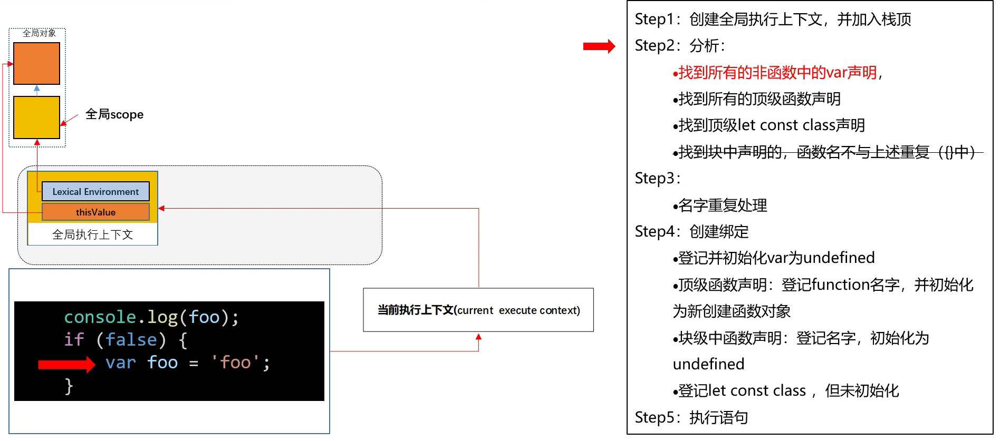

# 执行上下文和作用域

执行语句前创建的环境：


创建执行上下文：


## 全局执行上下文

- var 和 function 声明创建的变量和函数在全局对象中（浏览器环境是 window 对象），而 let,const,class 声明的变量创建在全局 scope 中。
- 在执行上下文寻找变量的顺序： 先到 scope 中寻找变量，然后再到全局对象查找。

```js
let a = "a";
console.log(a);
console.log(window.a); //没有
```

```js
var a = "a";
console.log(a);
console.log(window.a);
```

创建全局执行上下文：

<!--  -->



暂时性死区：


## 作用域

作用域：当前执行上下文或当前上下文的词法环境。

    全局作用域： 全局执行上下文

    函数作用域： 函数执行上下文

函数调用时的执行上下文： 函数在哪里创建，他就处于哪个执行上下文。

函数的作用域在函数创建时决定(词法作用域):

```js
function foo() {
	console.log(a);
}

function bar() {
	var a = 3;
	foo();
}

var a = 2;
bar();
```

## 块级作用域

## 一些问题

对象里写函数,对象的 fn 属性指向这个函数,函数并不属于这个对象,相对独立.

这个函数是全局的,对象不是语句块,不会产生作用域.

```js
var obj = {
	val: 3,
	fn: function () {
		return this.val;
	},
};
obj.fn(); //this=>obj, 3
```

## Reference

- [js 执行上下文与作用域\_哔哩哔哩\_bilibili](https://www.bilibili.com/video/BV1wD4y1D7Pp?from=search&seid=2212534765957722610)
