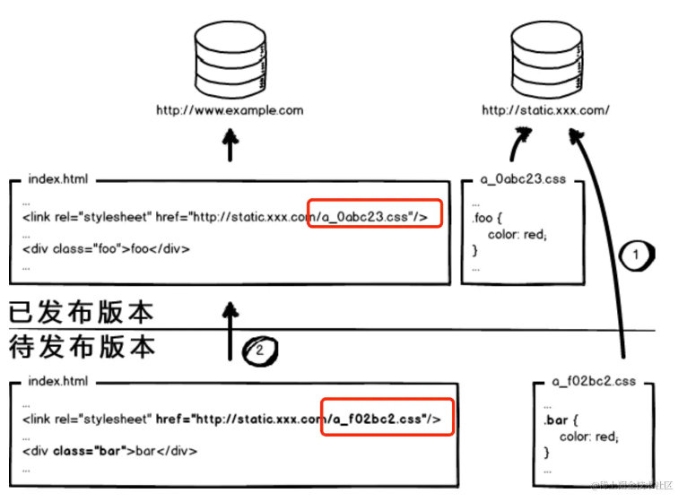

# 浏览器

## 浏览器缓存

### 为什么需要缓存

- 减少服务器负担
- 加快客户端网页加载速度

### 缓存位置（优先级从高到低）

- Memory Cache 内存缓存效率最快，但持续性短，关闭 Tab 页，内存缓存就会被释放。
- Service Worker Cache 运行在 JavaScript 主线程之外，无法直接访问 DOM。可以自由地控制缓存，可以完成离线缓存、消息推送、网络代理等功能。
- HTTP Cache HTTP 缓存。
- Disk Cache 硬盘缓存，读取速度慢，容量大，持续性长。所有浏览器缓存中，Disk Cache 覆盖面基本是最大的。

### HTTP 缓存

强缓存：如果缓存资源有效则直接使用缓存资源，不必再次向服务器发送请求。

- Expires。HTTP 响应头添加 Expires，表示资源的过期时间。对客户端与服务端的时间一致性有很高要求。是 HTTP 1.0 的方式，在 HTTP 1.1 中已经被弃用。
- Cache-Control。响应头。Http 1.1 提出，对缓存更精准的控制，优先级高于 Expires。
  - max-age=t：设置缓存的最大有效期，单位为秒。
  - private：设置了该字段值的资源只能被用户浏览器缓存，不允许任何代理服务器缓存。在实际开发当中，对于一些含有用户信息的 HTML，通常都要设置这个字段值，避免代理服务器(CDN)缓存。
  - no-store：设置了该字段表示禁止任何缓存，每次都会向服务端发起新的请求，拉取最新的资源
  - no-cache：设置了该字段需要先和服务端确认返回的资源是否发生了变化，如果资源未发生变化，则直接使用缓存好的资源

协商缓存：如果命中强制缓存，无需发起请求，直接使用缓存内容，如果没有命中强制缓存，如果设置了协商缓存，这个时候协商缓存就会发挥作用了。

- Last-Modified。HTTP 响应头添加 Last-Modified，表示资源的最后修改时间。下一次资源请求时，浏览器会在请求头中添加一个 If-Modified-Since，值为上一次服务器返回的 Last-Modified 的值。服务器比较这个值与最新资源的修改时间。如果未修改则返回 304，浏览器使用本地资源。如果已修改，返回 200 最新资源。缺点是时间精确度为秒级，有误差。
- ETag。响应头，表示资源生成的唯一标识符，如果资源改变则会变化。下一次请求，请求头添加 If-None-Match ，值为上一次服务器返回的 ETag 的值。服务器进行比较，比 Last-Modified 更精确，优先级也更高。

强缓存与协商缓存的区别在于：强缓存资源有效时直接使用缓存，不再向服务器发送请求，无效才会发送请求。而协商缓存都要发送请求判断缓存是否有效。

:::tip

命中协商缓存策略:Cache-Control 的 max-age 过期或为 no-cache。先向服务器发送一个请求，如果资源没有发生修改则返回 304 ，让浏览器使用缓存。如果资源发生修改则返回修改后的资源。

:::

### 缓存机制

强缓存策略和协商缓存策略是一起合作使用的。浏览器首先会根据请求的信息判断，强缓存是否命中，如果命中则直接使用资源。如果不命中则根据头信息向服务器发起请求，使用协商缓存，如果协商缓存命中的话，则服务器不返回资源，浏览器直接使用本地资源的副本，如果协商缓存不命中，则浏览器返回最新的资源给浏览器。

- 第一次加载资源，返回 200，浏览器下载资源，缓存资源与响应头。
- 下一次加载资源，强缓存优先级较高，浏览器先比较当前时间与上一次 返回 200 的时间差是否超过 Cache-Control 的 max-age，未超过则命中强缓存，不需要发送请求。不支持 Cache-Control 则使用 Expires 判断是否过期。
- 资源已过期则开始协商缓存，向服务器发送 If-None-Match / If-Modified-Since 的请求。服务器收到请求后优先根据 ETag 比较 If-None-Match 的值是否一致，如果一致没有修改则返回 304，命中协商缓存。不一致则返回 200 以及最新资源。
- 如果请求头没有 If-None-Match，则根据 If-Modified-Since 比较 Last-Modified 的值是否一致，如果一致没有修改则返回 304，不一致则返回 200。

:::tip 利用缓存进行性能优化？

主要是静态资源优化。

1. 使用强缓存/协商缓存。但强缓存不能保证版本更新时用户能及时使用新版本，协商缓存导致每次都有请求，优化效果不好。
2. 进一步优化，很多网站的资源后面都添加版本号，目的是使用强缓存，每次升级资源后强制改变版本号，防止浏览器进行缓存。但有可能只是修改了一个资源导致所有资源的版本号改变，性能优化不够。
3. 缓存控制精确到文件粒度，使用**数据摘要**算法对文件求摘要信息。
4. 用户体量大的网站静态资源和动态网页分集群部署，静态资源会被部署到CDN节点，会产生动态网页和静态资源部署不对应的情况。
   - 静态资源也需要摘要，并更新动态网页中的摘要url，需要采用非覆盖式更新方式，发布新版本时不能直接覆盖旧版本，实现平滑升级。
   - 灰度部署动态网页。
     

:::

## 浏览器多标签页通信

- WebSocket 使用服务器作为中介，标签页向服务器发送数据，服务器向其他标签页进行推送转发。
- Shared Worker
- localStorage 监听 localStorage 的变化。onStorage 事件。
- postMessage 获取对应标签页的引用，使用 postMessage 发送数据。
- BroadcastChannel

## Service Worker

运行在浏览器背后的独立线程，一般用来实现缓存功能。Service Worker 中涉及到请求拦截，所以必须使用 HTTPS 协议来保障安全。

实现缓存功能：

1. 注册 Service Worker
2. 监听到 install 后直接缓存需要的文件
3. 用户访问的时候拦截请求，查询是否存在缓存，存在缓存的话可以直接读取缓存文件，否则去请求数据

## 浏览器架构

多进程

- 浏览器主进程。控制主框架部分，包括界面显示，用户交互，子进程管理，也处理高权限任务，比如访问文件等。
- 网络进程。从浏览器进程独立出来的，负责网络资源加载。
- 渲染器进程。控制显示的任何内容为每个标签运行多个渲染器进程。
  - GUI 渲染线程。渲染界面
  - JS 引擎线程。一个渲染进程中只有一个 JS 线程
  - 事件触发线程
  - 定时器触发线程
  - http 异步请求线程
- 插件进程。插件易崩溃，所以需要通过插件进程来隔离，以保证插件进程崩溃不会对浏览器和页面造成影响。
- GPU 进程。在独立的进程中处理 GPU 任务，GPU 要处理来自多个应用的请求，在同一个界面中绘制图形。

特点：

- 多进程保证健壮性。
- 安全，限制某些进程的功能，进行沙箱处理。
- 节省内存。根据情况拆分更多的进程或聚合为更少的进程。

### 进程与线程

进程：包含独立内存空间，一个进程由一个或多个线程组成。同个进程下的各个线程之间共享该进程内的系统资源：内存空间，信号春丽等。

线程： 一个单一顺序的控制流。一个进程中可以并发多个线程，每个线程并行执行中不同的任务。

单线程：

- 一个进程内只有一个线程。单线程在程序执行时，所有程序必须按顺序执行，但效率一般低于多线程应用程序。对于 JS 来说，每个标签页一个 JS 线程。一个渲染进程内有多个不同的线程，对于渲染进程来说吗，它是多线程的。

## 浏览器渲染

### 渲染流水线

通过渲染器模块渲染。渲染机制比较复杂，分为很多子阶段，这个处理流程被称为渲染流水线。 

- 构建 DOM 树

  渲染引擎内部，有个叫 HTML 解析器（HTMLParser）的模块，负责将 HTML 字节流转换成 DOM 结构。

- 构建 CSSOM 树

- 构建渲染树

  DOM 树的根节点开始遍历每个可见节点。对每个可见节点，找到其适配的 CSS 样式规则并应用。

  不可见的元素当然就不会在这棵树中出现了。display 等于 none 的也不会被显示在这棵树里头，但是 visibility 等于 hidden 的元素是会显示在这棵树里头的。

- 布局

  从渲染树的根节点开始遍历，然后确定每个节点对象在页面上的确切大小与位置，布局阶段的输出是一个盒子模型，它会精确地捕获每个元素在屏幕内的确切位置与大小。

- 分层

  3D 变换、页面滚动，或者使用 z-index 做 z 轴排序等复杂效果，渲染引擎还需要为特定的节点生成专用的图层，并生成一颗对应的图层树（Layer Tree）。

- 渲染树绘制

#### CSS 间接影响 DOM 解析

- 解析 DOM 时，遇到 js 会暂停 DOM 解析先去执行 js 脚本。
- 执行 js 脚本时，如果当前页面有引用外部 css 或内联 css，渲染引擎要先把 CSS 转换为 CSSOM，因为 js 有修改 CSSOM 的能力。执行 JavaScript 之前还依赖 CSSOM。也就是说 CSS 会间接阻塞 DOM 的解析

### 回流和重绘

- 回流 reflow 元素的几何尺寸变化，需要重新验证并计算渲染树。

- 重绘 repaint 元素部分内容变化，不影响整体布局，比如背景色变化，不影响元素的尺寸位置。

> display:none 会触发回流，visibility:hidden 会触发重绘，没有尺寸和位置变化。

有些情况浏览器不会立即 reflow 或 repaint，而是批量进行 reflow，成为增量异步 reflow。浏览器自身针对回流重绘的优化：渲染队列机制。

### 渲染优化

JavaScript

- script 标签 放在 body 最后
- 使用 async/defer 属性

CSS

- link 方式引入

CSSOM DOM

- HTML/CSS 层级不要过深
- 尽量使用语义化标签

减少回流和重绘

- 不要使用 table 布局
- 尽可能修改类名而不是样式
- 避免频繁操作 DOM ,可以创建文档片段 documentFragment，应用好再添加到 DOM 中

## 同源策略

浏览器的安全机制，限制了从一个源的文档/脚本如何与另一个源的资源进行交互。用于隔离恶意的潜在文件。

同源：协议，域名，端口号必须一致。（子域名不同也是不同的源）

- 当前域不能访问其他域的 cookie，localStorage
- 当前域不能访问，操作其他域的 DOM。
- 当前域的 ajax/fetch 不能发送跨域请求。

### 跨域

- 通过 html 的标签(img, video, script)的 src 属性引入的外域资源不受限制
- jsonp script 标签内容是自动执行的，拿不到里面内容。只能是 get 请求
- iframe postMessage 传递数据
- CORS(跨域资源共享) 一种标准机制，是解决跨域最常见的方式。通过服务器的响应头实现控制。

  - 预检请求
    - 需预检的请求必须首先使用 OPTIONS 方法发起一个预检请求到服务器，以获知服务器是否允许该实际请求。
    - 一些简单的方法不会有预检请求（get/head/post）, 因为不能破坏 Web 的兼容性。
  - 常用的 CORS 头

    响应头:

    Access-Control-Allow-Origin:url/\* 服务器允许的域

    Access-Control-Allow-Methods: (POST, GET, OPTIONS) 服务器允许使用这些方法

    Access-Control-Allow-Headers: (X-PINGOTHER, Content-Type) 服务器允许使用这些请求头

    Access-Control-Allow-Credentials:允许带上的凭据(cookie 头)

    > 需要客户端也设置 withCredentials=true

    Access-Control-max-age:60000 允许的有效期，有效期内不用再发预检请求，单位秒

    请求头:

    Access-Control-Request-Methods 请求期望带上的额外的头

    Access-Control-Request-Headers 请求期望使用的请求方法

    Origin:

    Referer:

- 代理服务器 服务器之间的通信没有跨域问题，让服务器去请求相关资源并返回给前端（可以使用 nginx 或者 nodejs 中间件做反向代理）

  Nginx 相当于起了一个跳板机，这个跳板机的域名也是 client.com，让客户端首先访问 client.com/api，这当然没有跨域，然后 Nginx 服务器作为反向代理，将请求转发给 server.com，当响应返回时又将响应给到客户端。

  ```conf
  //nginx.conf
  server {
    listen  80;
    server_name  client.com; //客户端域名
    location /api {
      proxy_pass server.com; //服务端域名
    }
  }
  ```

#### 代理

- 正向代理：客户端设置代理服务器，代理服务器转发请求到目标服务器。本质上向服务器隐藏了真实的客户端。

- 反向代理： 服务器设置代理服务器，可能为了负载均衡等原因。收到请求，根据转发规则转发到目标真实服务器。本质上是向客户端隐藏了真实的服务器。

正反向代理的区别是中间的代理服务器是由哪一方设置的。

### 事件委托

事件机制：捕获-冒泡

事件委托（时间代理）利用了事件冒泡机制。事件在冒泡过程中上传到父节点，父节点通过事件对象获取目标节点。把子节点的监听函数定义在父节点上，由父节点的监听函数统一处理多个子元素的事件。

特点：

- 减少内存消耗
- 动态绑定事件 与目标元素增删无关，都可以找到。否则需要在元素删除前移除事件，元素新增后绑定事件比较麻烦。也在此处踩过坑，重新渲染导致：元素删除重新增加没有重新绑定事件。

## Reference

- [前端进阶高薪必看-浏览器篇 - 掘金](https://juejin.cn/post/7086015741429809188#heading-4)
- [【干货】十分钟读懂浏览器渲染流程 - 掘金](https://juejin.cn/post/6844903565610188807#heading-3)
- [浏览器渲染流程 - 掘金](https://juejin.cn/post/7090436813445136397)
